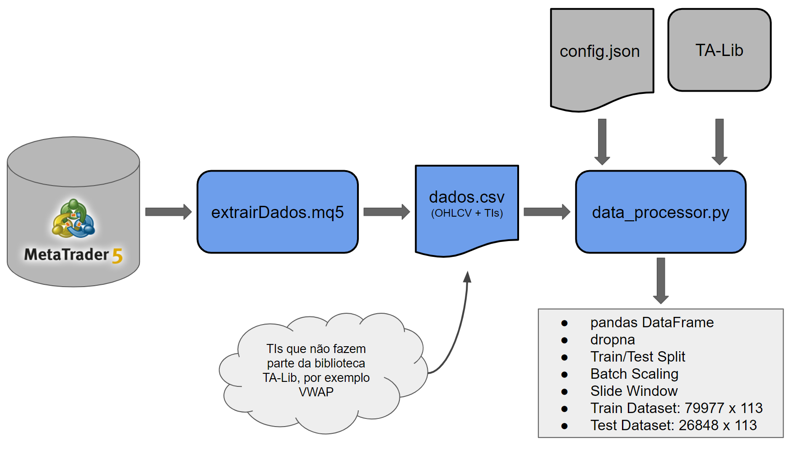

# Automated Trading System for Stock Index Using LSTM Neural Networks and Risk Management
Este repositório tem a finalidade de apresentar o pipeline adotado para o desenvolvimento do primeiro protótipo de um algotrading quantitativo, fruto da tese de meu doutorado.

O trabalho foi elaborado em parceria com a Thalita Ramires da Silva e apresentado na International Joint Conference on Neural Networks (IJCNN) em julho de 2020. Como está em processo de publicação, ainda não possui DOI.

Ferramentas e bibliotecas utilizadas: Tensorflow, Keras, MetaTrader5, socket, NumPy, Pandas, TA-Lib, json, scikit-learn, matplotlib

## Resumo

As recentes reduções da taxa Selic atraíram um grande número de investidores individuais para o mercado de renda variável, porém as previsões financeiras de séries temporais são um desafio devido à sua natureza não linear e caótica. Como resultado, muitas pessoas físicas têm seu patrimônio reduzido, afetando tanto psicologicamente como fisicamente. Para evitar decisões errôneas ocasionadas por decisões equivocadas, muitos pesquisadores e investidores estudaram, nas últimas décadas, métodos para melhorar a análise quantitativa. No campo da inteligência artificial, técnicas sofisticadas de aprendizado de máquina, como o Deep Learning, apresentaram melhor desempenho. Neste trabalho, um sistema de negociação automatizado foi construído para prever as tendências futuras dos preços do mini índice Bovespa. Usando um agente baseado em uma rede recorrente (LSTM) para aprender padrões temporais nos dados, o algoritmo dispara negociações automáticas de acordo com os dados históricos, indicadores de análise técnica e gerenciamento de risco. Os resultados demonstram que o método proposto, denominado LSTM-RMODV, apresenta melhor desempenho quando comparado com outros métodos, inclusive em relação à técnica buy-and-hold (B&H). O método proposto também funciona em condições de mercado de baixa ou alta, apresentando uma taxa sobre o lucro líquido com base no capital investido de 228,94%, assim mostrando ser um algoritmo capaz de gerar resultados positivos e uma possível alternativa para um investimento mais arrojado.

## Pipeline

### Coleta e Tratamento dos Dados

### Criação do Modelo | Treinamento | Teste
Após uma revisão da literatura, verificou-se que modelos estatísticos tradicionais performavam bem durante um tempo, mas sua acurácia degradava após um período. Alguns fatores podem ser levados em consideração: mudança do comportamento do mercado, o banco de dados utilizado para treinamento não possuía alguns cenários importantes para a extração de features, alguns modelos consideravam as séries temporais financeiras como um sistema linear, dentre outros.

Em contrapartida, modelos de Deep Learning têm ganhado bastante destaque nos últimos anos, principalmente redes recorrentes do tipo Long Short-Term Memory (LSTM), uma vez que são capazes de armazenar memória, lidam bem com o problema de Vanishing Gradient e têm demonstrado bons resultados para problemas com séries temporais não lineares, caóticas e estocásticas, características presentes em séries temporais financeiras.

Além disso, é importante utilizar camadas de DROPOUT, uma técnica essencial para a generalização de um modelo de Deep Learning.

### Teste em Ambiente Simulado (Deploy Simulado)

### Teste em Ambiente Real (Deploy)
É de suma importância o teste em ambiente simulado para corrigir possíveis problemas de programação e configurações da estratégia de trading. 

Apesar destas precauções, o MetaTrader 5 apresenta algumas pequenas diferenças entre seu backtest e as execuções em tempo real, portanto, é recomendável operar com lotes mínimos para efeito de testes e evitar grandes prejuízos desnecessariamente.

Para maiores detalhes sobre as estratégias adotadas, modelos utilizados para efeito de comparação e resultados experimentais, acesse o artigo pelo link [EM BREVE].

### Melhorias e Possíveis Trabalhos Futuros
As melhorias do projeto são separadas por ciclos. Considerando que este protótipo é o Ciclo 1, as futuras melhorias são listadas a seguir:

Ciclo 2: Otimização dos parâmetros do Trading Strategy e criação de outras estratégias. [Ok]
Ciclo 3: Redução da dimensionalidade e seleção das features mais relevantes. [Em desenvolvimento]
Ciclo 4: Utilizar dados das ações mais relevantes (Blue Chips) como features para o modelo previsor. [Em desenvolvimento]
Ciclo 5: Testar em outros mercados (ações, índices estrangeiros, bitcoin).
Ciclo 6: Testar outros modelos de Deep Learning (GRU, Convolutional Recurrent Neural Network, Autoencoders, CNN para análise gráfica, etc).
Ciclo 7: Fazer coleta de notícias e implementar técnicas de NLP para evitar falsas entradas.

